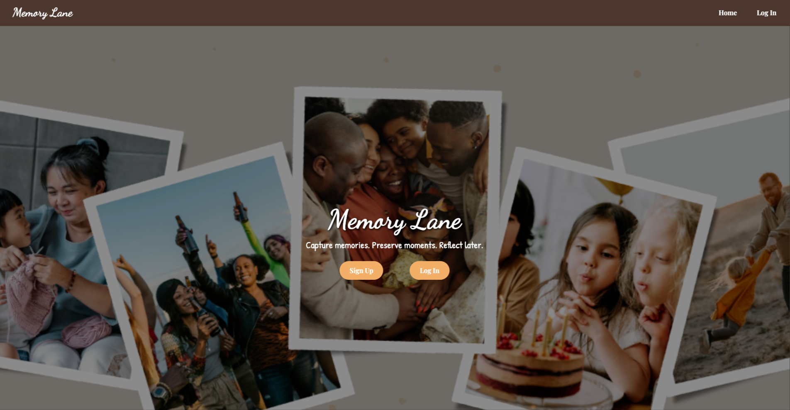
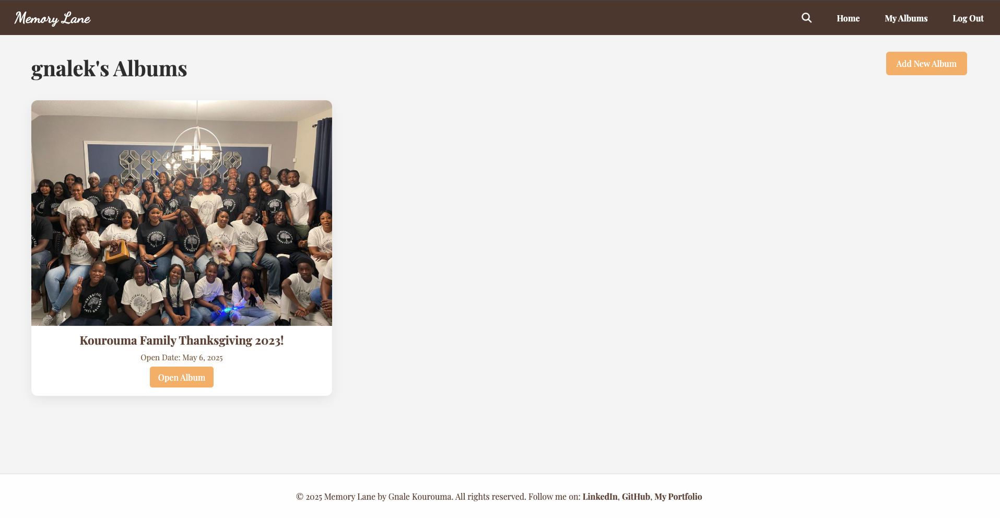
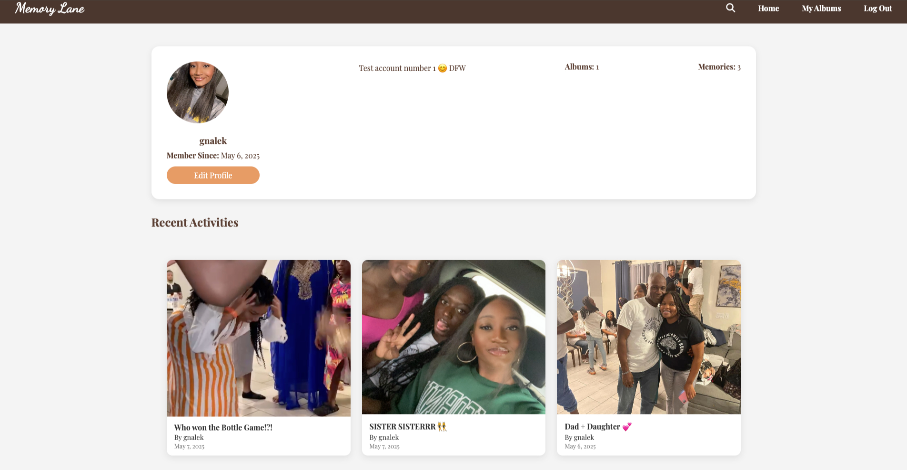

# Memory Lane

Memory Lane is a website that lets you upload photos, videos, or audio files to your personal albums. These albums can be kept unlocked or locked for you to rediscover at a later date with friends and family! 

View [MemoryLane](https://django-dear-future-me-151dabad0163.herokuapp.com/) here!

# For First Time Users

Once on you are on the landing page, you will be able to read through what the website is about and have the option to sign up with your username and password or login. Once logged in, you will be prompeted to create your first album on your 'My Albums' page! Don't forget to edit your profile page by clicking the 'Home' tab!

# Website Features
- Create personal albums with a title, album cover and a lock option!
- Add your special memories to your album. Include a a title and a special caption!
- View your recently added memories in your profile
- Search for other users and view their unlocked Albums and memories!
- Like and comment on your favorites memories!

# Memory Lane Previews

# Tech Used
- Frontend: HTML, CSS, JavaScript
- Backend: Python 3.11, Django 5.2
- Database: PostgreSQL
- Version Control: Git and Github

# Future Updates
- Able to add friends to keep updated on their memories!
- News Feed to keep you updated to your friends activities
- Ability to tag your friends in a memory
- Send a request to your friend to open you album with you!

